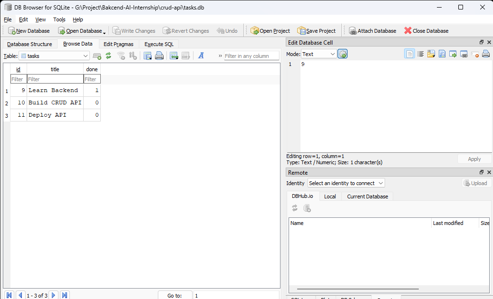
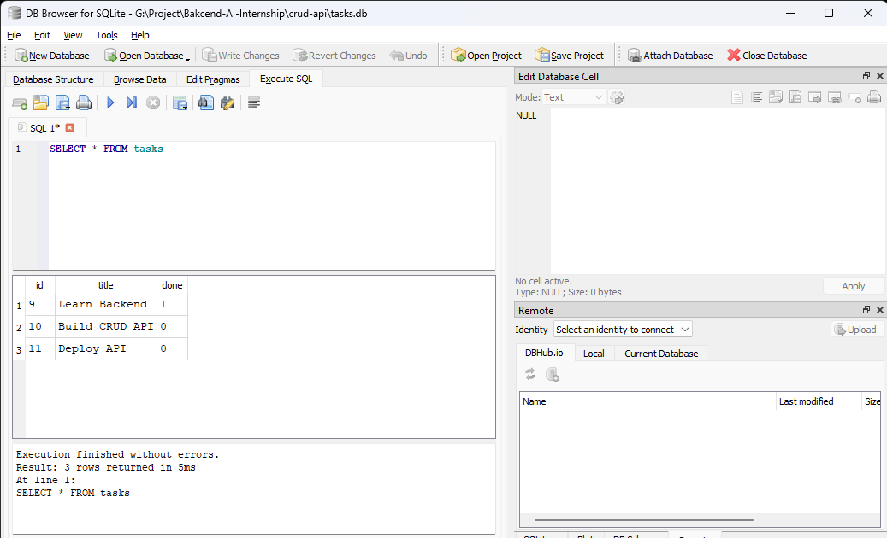

# CRUD API

A RESTful CRUD API built with **Node.js**, **Express.js**, and **SQLite** as part of the **FlyRank Backend AI Engineer Internship**.


## Getting started

Install dependencies:

```bash
npm install
```

Start the server:

```bash
npm start
```

or

```bash
node app.js
```

The API runs at `http://localhost:3000`.

OpenAPI documentation (Swagger UI) is available at:

```
http://localhost:3000/docs
```

The OpenAPI specification is located in `openapi.json`.

---

## Database

This project uses **SQLite** with **better-sqlite3**.

When the application starts, it automatically:

- Creates `tasks.db` if it does not exist.
- Creates the `tasks` table if it does not exist.
- Inserts three example tasks only when the table is empty.

The database file is ignored by Git and will be recreated automatically.

### Example SQL Query

```sql
SELECT COUNT(*) FROM tasks;
```

Returns the total number of tasks stored in the database.

---

## Endpoints

### `GET /`

Returns metadata about the API.

**Response**

```json
{
  "name": "Task API",
  "version": "1.0",
  "endpoints": ["/tasks"]
}
```

**Example**

```bash
curl http://localhost:3000/
```

---

### `GET /health`

Health check endpoint.

**Response**

```json
{
  "status": "ok"
}
```

**Example**

```bash
curl http://localhost:3000/health
```

---

### `GET /tasks`

Returns all tasks.

**Response**

```json
[
  {
    "id": 1,
    "title": "Learn Backend",
    "done": true
  },
  {
    "id": 2,
    "title": "Build CRUD API",
    "done": false
  },
  {
    "id": 3,
    "title": "Deploy API",
    "done": false
  }
]
```

**Example**

```bash
curl http://localhost:3000/tasks
```

---

### `GET /tasks/:id`

Returns a single task by its ID.

**Response (200)**

```json
{
  "id": 1,
  "title": "Learn Backend",
  "done": true
}
```

**Response (404)**

```json
{
  "error": "Task not found"
}
```

**Example**

```bash
curl http://localhost:3000/tasks/1
```

---

### `POST /tasks`

Creates a new task.

**Request body**

```json
{
  "title": "Learn SQLite"
}
```

**Response (201)**

```json
{
  "id": 4,
  "title": "Learn SQLite",
  "done": false
}
```

**Response (400)**

```json
{
  "error": "Title is required"
}
```

**Example**

```bash
curl -X POST http://localhost:3000/tasks \
  -H "Content-Type: application/json" \
  -d "{\"title\":\"Learn SQLite\"}"
```

---

### `PUT /tasks/:id`

Updates a task.

You may update the `title`, `done`, or both fields.

**Request body**

```json
{
  "title": "Learn better-sqlite3",
  "done": true
}
```

**Response (200)**

```json
{
  "id": 1,
  "title": "Learn better-sqlite3",
  "done": true
}
```

**Response (400)**

```json
{
  "error": "Request body must include title and/or done"
}
```

**Response (404)**

```json
{
  "error": "Task not found"
}
```

**Example**

```bash
curl -X PUT http://localhost:3000/tasks/1 \
  -H "Content-Type: application/json" \
  -d "{\"done\":true}"
```

---

### `DELETE /tasks/:id`

Deletes a task.

**Response (204)**

Returns no content.

**Response (404)**

```json
{
  "error": "Task not found"
}
```

**Example**

```bash
curl -X DELETE http://localhost:3000/tasks/1
```

---

## Screenshots

### Swagger UI


### SQLite Database



### SQL Query

