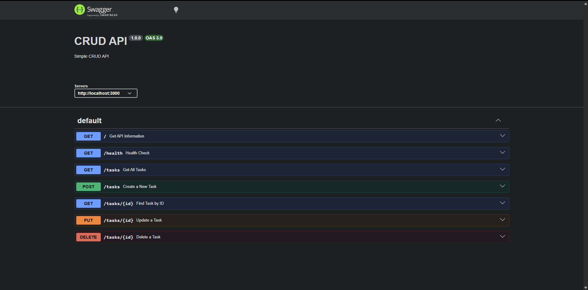

# CRUD API

A simple CRUD API built with Node.js and Express.js as part of the FlyRank Backend AI Engineer Internship Assignment.

## Features

- Create a task
- Read all tasks
- Read a task by ID
- Update a task
- Delete a task
- Swagger API Documentation

---

## Technologies

- Node.js
- Express.js
- Swagger UI Express

---

## Installation

Clone the repository:

```bash
git clone https://github.com/sandy-sh/Bakcend-AI-Internship.git
```

Go to the project folder:

```bash
cd crud-api
```

Install dependencies:

```bash
npm install
```

Start the server:

```bash
node app.js
```

Server runs at:

```
http://localhost:3000
```

Swagger Documentation:

```
http://localhost:3000/docs
```

---

## API Endpoints

| Method | Endpoint | Description |
|--------|----------|-------------|
| GET | / | Welcome message |
| GET | /health | Health check |
| GET | /tasks | Get all tasks |
| GET | /tasks/:id | Get task by ID |
| POST | /tasks | Create new task |
| PUT | /tasks/:id | Update task |
| DELETE | /tasks/:id | Delete task |

---

## Sample curl Output

```bash
curl.exe -i http://localhost:3000/tasks
```

Output:

```text
HTTP/1.1 200 OK
Content-Type: application/json; charset=utf-8

[
  {
    "id": 1,
    "title": "Learn Backend",
    "done": true
  },
  {
    "id": 2,
    "title": "Build CRUD API",
    "done": false
  },
  {
    "id": 3,
    "title": "Deploy API",
    "done": false
  }
]
```

---

## Swagger UI

Example:

